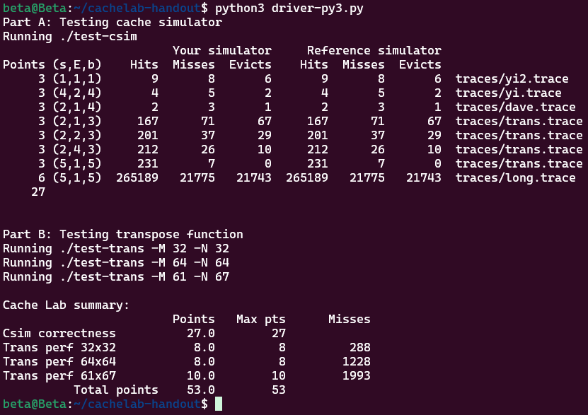

# Lab4 - CacheLab 实验报告

所属课程名称：计算机系统基础

## 一、实验目的

1. PartA：写一个小型的C语言程序，来模拟cache的行为(csim.c)

2. PartB：优化一个小型矩阵转置函数，最大限度地减少缓存缺失次数(trans.c)

## 二、实验环境

1. 操作环境：`Ubuntu24.04.1 LTS`

2. 编译器：gcc

3. 缓存模型：1KB 直接映射 Cache，块大小 32B

4. 测试工具：`csim-ref`、`test-csim`、`test-trans`

## 三、实验内容与实现思路

### Part A：Cache Simulator

根据给定参数 (s, E, b)，模拟缓存对 Valgrind 生成的内存访问轨迹的行为，统计 `hits`、`misses`、`evictions`

缓存采用 LRU（最近最少使用）替换策略，忽略指令访问（I）。

使用结构体表示cache line：

```c
typedef struct {
    int vaild;//有效位
    unsigned int tag;//标签
    int count;//用于LRU计数
}Cache;
```

使用二维数组模拟 cache：`S = 2^s` 个 set，每个 set 含 `E` 行

对每次内存访问：

1. 解析地址，得到 tag 和 set index
2. 在对应 set 中查找是否命中
3. 命中：更新 LRU 信息
4. 未命中：若有空行，直接填入；否则选择 LRU 行进行替换，并计一次 eviction

- 对于 M 操作，视为一次 load + 一次 store

使用 `test-csim` 对 8 组官方测试用例进行测试，结果所有测试用例中 hits、misses、evictions 数均与 `csim-ref` 完全一致

### Part B：矩阵转置优化

实现 `transpose_submit` 函数，使其在指定 Cache 配置下尽量减少 cache miss 数。测试矩阵规模为：`32 × 32`、`64 × 64`、`61 × 67`

限制条件：不允许使用数组或 malloc；每个函数最多 12 个 `int` 局部变量

缓存为直接映射，冲突未命中是主要性能瓶颈，因此采用分块策略。

##### （1）32 × 32 矩阵

- 采用 8 × 8 分块
- 每次读取一整行到寄存器，再写入转置位置
- 减少连续访问带来的冲突未命中

##### （2）64 × 64 矩阵

- 使用 8 × 8 分块，再细分为 4 × 4 子块
- 利用寄存器暂存中间结果，避免 A 和 B 映射到同一 cache set
- 有效减少对角线及行列交错访问造成的冲突

##### （3）61 × 67 矩阵

- 非规则尺寸，采用 16 × 16 分块
- 边界处增加条件判断
- 在保证正确性的同时取得较好缓存性能

使用 `test-trans` 测试 `transpose_submit`

## 四、实验结果

使用`python3 driver-py3.py`对两个程序都做测试，结果截图如下：

 

Part A 得分：27 / 27

Part B 得分：三种矩阵misses均在要求范围内，26 / 26

## 五、实验总结

通过 Part A 的实现，我加深了对缓存结构和替换策略的理解；通过 Part B 的优化实验，我直观体会到程序访存模式对缓存性能的巨大影响。

实验表明：合理的 blocking 能显著减少 cache miss；对于直接映射 cache，避免冲突访问尤为关键；针对不同规模数据采用不同策略可以获得更优性能。

本实验有效提升了我对计算机体系结构和性能优化的理解。